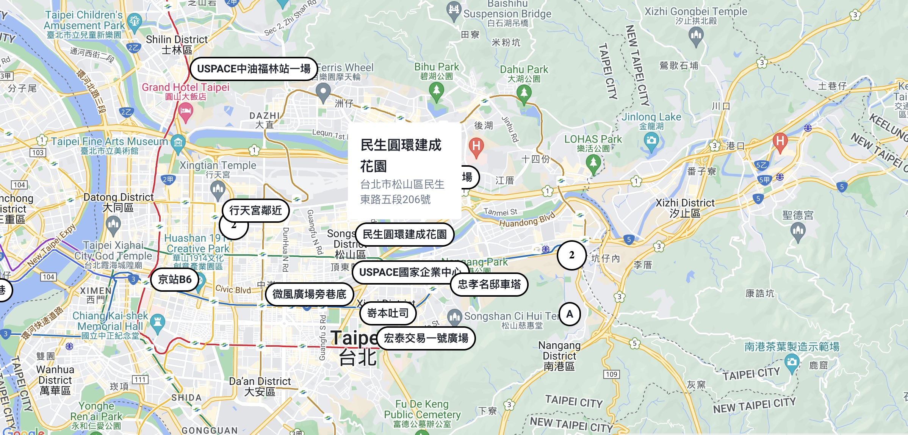

# Google Map, Clusters, for React

## 介紹



如過您希望製作像 Airbnb 那樣自訂標記的樣式，動態顯示一些資訊並且當用戶和其互動時可以渲染自訂的 React 元件，那麼您來對地方了。

本範例嘗試使用 Google 官方的 React Wrapper 函式庫實作 Google Map 功能，目標為自訂 MapOverView 達成在 Map 上加入複雜的 Marker。
例如像 Airbnb 點擊房源時可以展開。這個範例我們會支援 [Marker Clustering](https://developers.google.com/maps/documentation/javascript/marker-clustering)

本範例使用 Next.js 整合 [Google Map 官方的套件](https://developers.google.com/maps/documentation/javascript/react-map)。

## 建立專案

```sh
$ npx create-next-app demo
$ cd demo

# 安裝相依套件
$ npm i @googlemaps/react-wrapper @googlemaps/markerclusterer

# OR

$ git clone
```

## 取得 Google Map 金鑰

參考 [Google 官方教學](https://developers.google.com/maps/documentation/javascript/get-api-key) 取得金鑰。

## 抽取負責顯示地圖的容器元件

```sh
$ mkdir components
```

```js
// MapContainer.jsx
import { Wrapper, Status } from "@googlemaps/react-wrapper";
import Map from "./Map";

const render = (status) => {
  switch (status) {
    case Status.FAILURE:
      return <div>Error</div>;
  }
  return <div>Loading...</div>;
};

const MapContainer = () => {
  return (
    <Wrapper
      apiKey={process.env.NEXT_PUBLIC_GOOGLE_MAP_API_KEY}
      render={render}
    >
      <Map />
    </Wrapper>
  );
};

export default MapContainer;
```

接著在建立一個 Map 元件，為了單純我們直接把如何初始化一個 Map 和 Markers 的邏輯統一在一個檔案。

```js
// Map.jsx
import { useRef, useEffect, useState } from "react";

import { BUILDINGS } from "@/constaints";

const DEFAULT_MAP_CENTER = {
  lat: 25.05807,
  lng: 121.53748,
};
const DEFAULT_MAP_ZOOM = 15;

const Map = () => {
  const ref = useRef(null);
  const [center, setCenter] = useState(DEFAULT_MAP_CENTER);
  const [zoom, setZoom] = useState(DEFAULT_MAP_ZOOM);
  const [map, setMap] = useState(null);

  // You can extract functions out of the component as props.
  const onClick = (e) => {};
  const onDrag = (e) => {};
  const onBoundsChanged = (googleMap) => {
    // const bounds = map.getBounds();
    // const ne = bounds.getNorthEast();
    // const sw = bounds.getSouthWest();
  };
  const onCenterChanged = (googleMap) => {};

  useEffect(() => {
    if (ref.current && !map) {
      // 初始化 Google Map
      const googleMap = new window.google.maps.Map(ref.current, {
        center,
        zoom,
        disableDefaultUI: true,
        clickableIcons: false,
        disableDoubleClickZoom: true,
        gestureHandling: "greedy",
      });

      googleMap.addListener("click", onClick);
      googleMap.addListener("drag", onDrag);
      googleMap.addListener("bounds_changed", () => onBoundsChanged(googleMap));
      googleMap.addListener("center_changed", () => onCenterChanged(googleMap));

      // (補充)：最基本加入 Markers 的方式，但這裡我們只是示範。請移除。
      // const infoWindow = new window.google.maps.InfoWindow();
      // const markers = BUILDINGS.map((item, i) => {
      //   const label = item.name;
      //   const marker = new window.google.maps.Marker({
      //     position: {
      //       lat: item.lat,
      //       lng: item.lon,
      //     },
      //     label,
      //     map: googleMap,
      //   });

      //   marker.addListener("click", () => {
      //     infoWindow.setContent(label);
      //     infoWindow.open(googleMap, marker);
      //   });
      //   return marker;
      // });

      setMap(googleMap);
    }
  }, [center, zoom, map]);

  return <div id="map" ref={ref} className="w-full h-full"></div>;
};

export default Map;
```

到此您已經實作出最基本的功能了。

## 使用 MapOverView 自訂 Marker

這裡我們將會使用 OverlayView 類別而不是一般 Marker？因為我們的需求效果使用一般 Marker 很難做到。官方提到 Marker 只能變更 icon 圖片和 label。
而 Google Map API 提供了 [OverlayView Class](https://developers.google.com/maps/documentation/javascript/reference/overlay-view#OverlayView)

> 如果您不需要複雜的 Marker 您可以[參考官方教學](https://developers.google.com/maps/documentation/javascript/custom-markers)找到適合您的作法。

> [OverlayView](https://developers.google.com/maps/documentation/javascript/customoverlays) 是綁定經緯度座標，在地圖上的物件。當您拖動或縮放地圖時，它們會隨地圖一起移動。
> Maps JavaScript API 提供了一個名為 OverlayView 的類別，用於創建自定義的覆蓋物。OverlayView 是一個基礎類別，當您創建自己的覆蓋物時，需要實現它提供的幾個方法。此外，該類別還提供了一些方法，可以在屏幕坐標和地圖上的位置之間進行轉換。

因此讓我們來建立一個 `MapOverlayView` 元件。首先我們需要實作一個 class 繼承 `google.maps.OverlayView` 並至少需要實作 `onAdd`, `onRemove`, `draw` 。不過為了將 React 元件和 Google Map 接起來我們在建立的過程還需要掛載一個元素進去。範例如下

```js
// MapOverlay.jsx
import { useMemo, useEffect, memo } from "react";
import { createPortal } from "react-dom";

/**
 *
 * @param props { element: HTMLElement, position: { lat: number, lng: number }
 * @returns {MapOverlayView}
 */
const createMapOverlayViewInstance = (props) => {
  class MapOverlayView extends window.google.maps.OverlayView {
    element = null;
    position = null;

    constructor(element, position) {
      super();
      this.element = element;
      this.position = position;
    }

    getPosition() {
      return new window.google.maps.LatLng(
        this.position.lat,
        this.position.lng
      );
    }

    getVisible() {
      return true;
    }

    onAdd() {
      this.getPanes().floatPane.appendChild(this.element);
    }

    onRemove() {
      if (this.element.parentNode) {
        this.element.parentNode.removeChild(this.element);
      }
    }

    draw() {
      const projection = this.getProjection();
      const position = this.getPosition();
      const point = projection.fromLatLngToDivPixel(position);

      if (!point) {
        return;
      }

      this.element.style.transform = `translate(${point.x}px, ${point.y}px)`;
      // this.element.style.left = `${point.x}px`;
      // this.element.style.top = `${point.y}px`;
    }
  }

  return new MapOverlayView(props.element, props.position);
};

/**
 * 方便我們使用 React 元件的方式建立 OverlayView
 * @param props { map: google.maps.Map, position: { lat: number, lng: number }, zIndex: number, children: React.ReactNode }
 * @returns {JSX.Element}
 */
const MapOverlayView = ({ map, position, zIndex, children }) => {
  const element = useMemo(() => {
    const div = document.createElement("div");
    div.style.position = "absolute";
    return div;
  }, []);

  const overlay = useMemo(() => {
    return createMapOverlayViewInstance({ element, position });
  }, [element, position]);

  useEffect(() => {
    overlay?.setMap(map);
    return () => {
      overlay?.setMap(null);
    };
  }, [overlay, map]);

  useEffect(() => {
    element.style.zIndex = `${zIndex}`;
  }, [element, zIndex]);

  return createPortal(children, element);
};

export default memo(MapOverlayView);
```

上面這個元件目的是協助我們之後藉由將其他元件擺在 `MapOverlayView` 裡面作為子元素時可以建立 Google Map 的 OverlayView。

## 建立 MapMarker 和子元件

接著，讓我們使用 MapOverlay 元件來建立我們的 Marker 就是 `MapMarker.jsx` 和其顯示的內容。

```js
// MapMarker.jsx
import { useState, memo } from "react";

import MapOverlay from "./MapOverlay";
import MapCard from "./MapCard";
import MapButton from "./MapButton";

const MapMarker = ({ map, data }) => {
  const [isOpen, setIsOpen] = useState(false);
  const handleToggle = () => {
    setIsOpen((prev) => !prev);
  };

  return (
    map && (
      <MapOverlay
        map={map}
        position={{
          lat: data.lat,
          lng: data.lon,
        }}
      >
        <div
          className="flex flex-col relative justify-center items-center"
          onTouchStart={(e) => {
            // Avoid click event on Google Map.
            e.stopPropagation();
          }}
          onClick={(e) => {
            // Avoid click event on Google Map.
            // e.stopPropagation();
          }}
        >
          {isOpen && <MapCard data={data} />}
          <MapButton onClick={handleToggle}>{data.name}</MapButton>
        </div>
      </MapOverlay>
    )
  );
};

export default memo(MapMarker);
```

內容您可以依據您自行的需求調整元件，這裡做一個簡單的開關卡片的效果

```js
// MapButton.jsx
const MapButton = ({ children, onClick }) => {
  return (
    <button
      type="button"
      className="px-2 py-1 rounded-full bg-white border-2 border-black font-bold text-sm hover:bg-gray-200 transition duration-300 ease-in-out"
      onClick={onClick}
    >
      {children}
    </button>
  );
};

export default MapButton;
```

```js
// MapCard.jsx
const MapCard = ({ data }) => {
  return (
    <div className="min-w-[150px] p-4 rounded border-1 border-black bg-white absolute bottom-[36px]">
      <div className="flex flex-col text-md font-bold text-lg">{data.name}</div>
      <div className="flex flex-col text-md text-sm text-slate-500">
        {data.city + data.zone + data.road}
      </div>
    </div>
  );
};

export default MapCard;
```

## 進階 - 支援 Cluster （聚合功能）

要支援聚合功能並不複雜，我們可以使用官方提供的[函式庫](https://github.com/googlemaps/js-markerclusterer)來完成。

```sh
$ npm i @googlemaps/markerclusterer
```

基本的用法

```js
import { MarkerClusterer } from "@googlemaps/markerclusterer";

const markerCluster = new MarkerClusterer({ map, markers });
```

現在我們來整合到我們的範例，首先到我們的 `Map.jsx` 加入 MarkerClusterer 的部分

```js
import { MarkerClusterer } from "@googlemaps/markerclusterer";
// ...
const Map = () => {
  // ...

  useEffect(() => {
    if (ref.current && !map && !cluster) {
      // ...
      const googleMarkerCluster = new MarkerClusterer({
        map: googleMap,
        renderer: {
          render: ({ count, position }) => {
            const svg = `
              <svg width="40" height="40" xmlns="http://www.w3.org/2000/svg">
                <circle cx="20" cy="20" r="19" stroke="black" stroke-width="2" fill="white" />
                <text x="20" y="24" font-size="14px" font-weight="bold" text-anchor="middle" fill="black">${count}</text>
              </svg>
            `;

            const url =
              "data:image/svg+xml;charset=UTF-8," + encodeURIComponent(svg);

            const icon = {
              url: url,
              size: new google.maps.Size(40, 40),
              origin: new google.maps.Point(0, 0),
              anchor: new google.maps.Point(20, 20),
              scaledSize: new google.maps.Size(40, 40),
            };

            return new google.maps.Marker({
              position: position,
              icon: icon,
            });
          },
        },
      });
      setMap(googleMap);
      setCluster(googleMarkerCluster);
    }
  }, [center, zoom, map, cluster]);

  return (
    <>
      <div id="map" ref={ref} className="w-full h-full"></div>
      {map &&
        BUILDINGS.map((building) => {
          return (
            <MapMarker
              map={map}
              cluster={cluster}
              data={building}
              key={building.id}
            />
          );
        })}
    </>
  );
};

export default Map;
```

接著我們將 `cluster` 傳入 `MapMarker` 在傳入 `MapOverlay`

最後在 `MapOverlay` 中我們將點加入叢集

```js
useEffect(() => {
  cluster?.addMarker(overlay);
  return () => {
    cluster?.removeMarker(overlay);
  };
}, [cluster, overlay]);
```


## 2024 Marker deprecated, Using AdvancedMarkerElement

設定參數 `libraries` 為 `['marker']` 之後可使用 `window.google.maps.marker.AdvancedMarkerElement`。

```js
<Wrapper
  googleMapKey={process.env.REACT_APP_GOOGLE_MAP_KEY}
  libraries={['marker']}
>
  <Map />
</Wrapper>
```

注意事項：

- 使用 `AdvancedMarkerElement`，Goggle `Map` 須使用 `mapId` 參數。
- 使用了 `mapId` 參數不支援舊版的 style 參數。[雲端式地圖樣式設定總覽](https://developers.google.com/maps/documentation/maps-static/cloud-customization?hl=zh-tw)

```js
const googleMap = new window.google.maps.Map(ref.current, {
  center,
  zoom,
  mapId: 'DEMO_MAP_ID',
});

const pinElement = new window.google.maps.marker.PinElement({
  glyph: POINT.name,
  glyphColor: '#0000ff',
});

new window.google.maps.marker.AdvancedMarkerElement({
  position: {
    lat: POINT.lat,
    lng: POINT.lng,
  },
  title: POINT.name,
  content: pinElement.element,
  map: googleMap,
});
```

### 參考資料

- [MapOptions](https://developers.google.com/maps/documentation/javascript/reference/map?hl=zh-tw#MapOptions)
- [google.maps.marker.AdvancedMarkerElement](https://developers.google.com/maps/documentation/javascript/reference/advanced-markers?hl=zh-tw#AdvancedMarkerElement)
- [PinElement](https://developers.google.com/maps/documentation/javascript/reference/advanced-markers?hl=zh-tw#PinElement.background)
- [新專案建議使用 react-google-maps](https://github.com/visgl/react-google-maps)
- [AdvancedMarkerElement 改用進階標記官方教學](https://developers.google.com/maps/documentation/javascript/advanced-markers/migration?hl=zh-tw)
- [Google Maps JavaScript API React Wrapper](https://www.npmjs.com/package/@googlemaps/react-wrapper)
- [@googlemaps/js-api-loader](https://www.npmjs.com/package/@googlemaps/js-api-loader)
